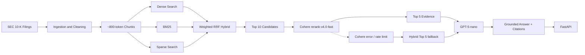
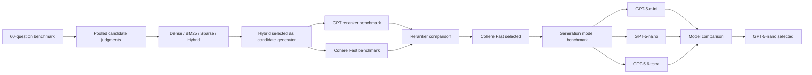

# SEC RAG Engine

Production-oriented RAG system over SEC 10-K filings. It retrieves evidence from Apple, Microsoft, and NVIDIA annual reports, reranks it, and returns grounded answers with citations—or a refusal when the filings do not support the question.

## At a Glance

- 60-question SEC 10-K benchmark
- 90.3% Recall@10
- 73.5% Precision@5 after Cohere reranking
- 96.4% MRR
- 100% Numeric Evidence Hit@5
- 100% unsupported-query refusal on the final sanity test
- ~2.0s median end-to-end latency in a controlled benchmark
- FastAPI serving layer
- graceful reranker fallback

## Architecture



## Why This Project

SEC 10-Ks are long, dense, and hard to search with a single retriever. This project compares dense, BM25, sparse, and hybrid retrieval on a fixed benchmark, then selects reranking and generation models from measured quality and latency—not guesswork. The serving path is production-oriented: citations, refusal on unsupported questions, and immediate fallback if Cohere is rate-limited.

## Key Features

- SEC 10-K ingestion and structured metadata
- dense, BM25, and sparse retrieval
- weighted RRF hybrid fusion
- Cohere reranking
- grounded generation with citations
- unsupported-query refusal
- FastAPI
- latency diagnostics
- graceful reranker fallback
- evaluation framework

## Evaluation



**Methodology**

- 60 questions: 20 Apple, 20 Microsoft, 20 NVIDIA
- 55 supported, 5 unsupported
- labels come from a pooled Dense / BM25 / Sparse / Hybrid top-10 candidate set
- LLM-assisted relevance judging
- human review of every medium/low-confidence judgment
- 71 ambiguous judgments were human-reviewed
- qrels are incomplete outside that candidate pool

The 819 pooled candidates were not all labeled by hand.

| Stage | Metric | Result |
|---|---|---|
| Hybrid | Recall@10 | 0.903 |
| Hybrid + Cohere | Recall@5 | 0.757 |
| Hybrid + Cohere | Precision@5 | 0.735 |
| Hybrid + Cohere | MRR | 0.964 |
| Hybrid + Cohere | Numeric Evidence Hit@5 | 1.000 |
| Cohere Reranker | Median latency | 0.207s |
| Final RAG | Source hit rate | 1.000 |
| Final RAG | Unsupported refusal | 1.000 |
| Final RAG | Median latency | ~2.024s |
| Final RAG | p95 latency | ~3.130s |

Cohere keeps Recall@10 at 0.903 while improving top-5 ranking. Hybrid is therefore the candidate generator; Cohere is the production reranker.

Generation models were compared on **identical cached Cohere evidence**. That isolates answer-model quality and latency. It is not a live Cohere stress test. Cohere Trial keys are limited to 10 calls/minute, so live runs can hit HTTP 429 and use hybrid fallback. That is quota, not inference latency.

## Production RAG Flow

1. Hybrid retrieves top 10
2. Cohere rerank-v4.0-fast reranks those 10
3. Top 5 evidence chunks are sent to `gpt-5-nano`
4. The model answers only from that evidence, with citations
5. If evidence is insufficient, it refuses
6. On Cohere 429 or API error, the request continues with hybrid top-5 and `reranker_fallback=true`

Serving does not sleep on rate limits. `COHERE_RERANK_ENABLED=false` skips Cohere.

## API

```text
GET  /health
POST /ask
```

`POST /ask` body:

```json
{
  "question": "What were Apple's total net sales in fiscal 2024?",
  "top_k": 5
}
```

Response fields: `question`, `answer`, `sources`, `generation_model`, `reranker_fallback`, `reranker_fallback_reason`, `timings`.

Swagger UI: `http://127.0.0.1:8000/docs`

## Setup

```bash
python -m venv .venv
source .venv/bin/activate
pip install -r requirements.txt
```

`.env` (do not commit secrets):

```text
OPENAI_API_KEY=
PINECONE_API_KEY=
COHERE_API_KEY=
```

Optional: `COHERE_RERANK_ENABLED=true`

## Run

```bash
fastapi dev api/main.py
```

## Evaluation Commands

```bash
python -m evaluation.evaluate_v2
python -m evaluation.evaluate_cohere_reranker
python -m evaluation.evaluate_generation_models
python -m evaluation.evaluate_final_rag
```

The generation-model comparison reuses cached Cohere rankings so it does not consume Trial quota.

## Limitations

- evaluated on three companies
- qrels are pooled and incomplete outside the retrieval pool
- Cohere Trial accounts are limited to 10 calls/minute
- arbitrary ticker ingestion is not automated
- production monitoring and deployment are not included

## Next Steps

- arbitrary ticker/company ingestion
- incremental filing updates
- metadata filtering
- multi-company comparisons
- streaming `/ask` endpoint
- observability and deployment
