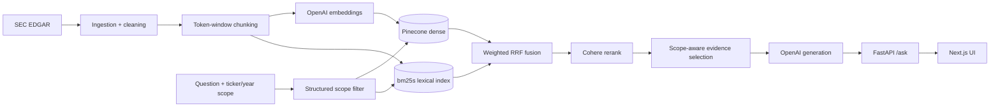

# AlphaBrief

AI-powered research for SEC 10-K filings with grounded answers and source-level evidence.

Ask a plain-English question about a public company's annual report and get a response built
only from retrieved filing text, with every answer backed by retrieved filing evidence. When
the filings do not support an answer, the system refuses instead of guessing.

## Live Demo

- Frontend: https://secfrontend.vercel.app
- Backend API docs (Swagger): https://sec-rag-engine.vercel.app/docs

## What It Does

- Pick one or more companies and fiscal years, or ask across the whole corpus.
- Ask a natural-language question ("How did operating margin change?", "What does the company
  say about AI-related risk?").
- Get a grounded answer with inline `[Source N]` citations.
- Inspect the evidence: each citation opens the underlying 10-K passage with a link to the
  filing on SEC.gov.
- Compare across years or companies in a single question; each scope stays tied to its own
  filing.

## Architecture



Pipeline: SEC EDGAR → ingestion and cleaning → chunking → embeddings → Pinecone dense index →
bm25s lexical index → RRF fusion → Cohere reranking → scope-aware evidence selection → OpenAI
generation → FastAPI → Next.js UI.

## Retrieval Design

Retrieval is a dense + lexical hybrid:

- **Dense**: OpenAI `text-embedding-3-small` (1536-dim), stored in the Pinecone `sec-rag-engine`
  index.
- **Lexical**: `bm25s` (Lucene-style BM25, `k1=1.5`, `b=0.75`) over a persisted, version-pinned
  index that ships with the deployment.
- **Fusion**: each retriever returns `candidate_k = 10` results; they are combined with
  Reciprocal Rank Fusion (`RRF_K = 60`, equal weight for dense and BM25).
- **Reranking**: the fused candidates go to Cohere `rerank-v4.0-fast`, which produces the final
  top-5 evidence set.

Structured scoping happens **before** generation. A request carries an optional list of tickers
and fiscal years; these become a `RetrievalFilter` that constrains every retriever, so the
generator never sees a chunk outside the requested scope. If a requested year has no ingested
10-K for a requested company, the API returns a structured `422` rather than widening scope.

For comparison questions (two or more scopes), retrieval runs independently per scope, using
one shared query embedding across scopes for comparability. The per-scope candidate sets are
deduplicated into a union (capped at 60), and a **single** Cohere rerank is run over that union.
Evidence selection then guarantees at least one chunk per requested scope. Because each scope is
retrieved and filtered on its own before the union is formed, one company's or year's text
cannot leak into another scope's evidence.

## Multi-Year / Comparison Support

Scope is derived from what the request specifies:

- **Ticker only** → all ingested filings for that company.
- **Ticker + year** → that exact fiscal year.
- **Multiple scopes** (several tickers, several years, or both) → comparison mode, one shared
  code path for company-vs-company, year-vs-year, and company+year comparisons.
- **Unsupported year** → structured `422` (`fiscal_year_not_available`) with the available
  years, or `fiscal_years_without_tickers` when years are given with no ticker.

There is no silent scope widening. A scope-validation failure is surfaced to the caller; it is
never retried against a different year or company.

## SEC Ingestion

Ingestion uses the official SEC submissions API:

- Exact `10-K` discovery only; `10-K/A` amendments are excluded by string equality.
- Fiscal year is derived from the filing's `reportDate`, so non-calendar filers (Apple,
  Microsoft, Walmart) are dated correctly.
- Historical filings are discovered from the same submissions history, not just the latest.
- A resumable, accession-keyed ledger re-validates each completed stage's on-disk artifacts, so
  a rerun picks up at the earliest invalid stage. Accession numbers are deduplicated.
- Chunk IDs are deterministic (`{TICKER}_{FY}_{FILING_TYPE}_{ACCESSION}_{INDEX}`), so
  re-ingestion overwrites rather than duplicates.
- Verification checks dense / sparse / BM25 parity for a filing.
- The bm25s index is rebuilt and ranking-parity-checked by a dedicated script and committed;
  the read-only deployment loads the bundled index and never rebuilds it.

CIK-lineage edge cases are handled generically: ExxonMobil's recent 10-Ks were filed under a
legacy registrant CIK, which is recorded as a `lineage` block in the registry without any
company-specific code in the SEC client.

## Evaluation

Retrieval is evaluated offline against `benchmark_v3_repool` — 125 questions (115 answerable,
10 deliberately unsupported fiscal years) over the current corpus, with **model-assisted
relevance judgments** (a first-pass judgment plus a lower-temperature review pass). These are
not human-labeled judgments; qrels outside the pooled candidate set are incomplete.

Structural gates (scope correctness, cross-scope leakage, numeric-year attribution) are checked
by the unit test suite and by dedicated multi-year validation scripts.

| Metric | Result |
|---|---|
| MRR | 0.884 |
| Recall@10 | 0.701 |
| Precision@5 | 0.623 |
| Fiscal-year filter correctness | 1.000 |
| Cross-year leakage | 0.000 |
| Cross-company leakage | 0.000 |
| Comparison scope coverage | 1.000 |
| Numeric-year correctness (anchored) | 1.000 |
| Backend tests | 320 / 320 |

## Production Corpus

10 companies, 31 10-K filings, 4,262 chunks. Three fiscal years per company (four for NVIDIA).

| Ticker | Company | Fiscal years |
|---|---|---|
| AAPL | Apple | 2023–2025 |
| AMZN | Amazon | 2023–2025 |
| GOOGL | Alphabet | 2023–2025 |
| JPM | JPMorgan Chase | 2023–2025 |
| META | Meta Platforms | 2023–2025 |
| MSFT | Microsoft | 2024–2026 |
| NVDA | NVIDIA | 2023–2026 |
| UNH | UnitedHealth Group | 2023–2025 |
| WMT | Walmart | 2024–2026 |
| XOM | ExxonMobil | 2023–2025 |

## Tech Stack

- **Backend**: Python, FastAPI, Uvicorn.
- **Frontend**: Next.js, TypeScript (deployed on Vercel).
- **Retrieval**: OpenAI `text-embedding-3-small` + Pinecone (dense), `bm25s` (lexical), RRF
  fusion, Cohere `rerank-v4.0-fast`.
- **Generation**: OpenAI `gpt-5-nano`, constrained to the retrieved evidence.
- **Infrastructure**: Pinecone managed indexes, Vercel (read-only Python runtime for the API,
  static + SSR for the UI).
- **Evaluation**: offline pooled benchmark, model-assisted judging, `unittest` structural gates.

## API

```text
GET  /health
GET  /companies
GET  /companies/{ticker}/filings
POST /ask
```

`POST /ask` request:

```json
{
  "question": "How did Apple's total net sales change from fiscal 2023 to fiscal 2024?",
  "tickers": ["AAPL"],
  "fiscal_years": [2023, 2024],
  "top_k": 5
}
```

`tickers` and `fiscal_years` are optional. Omitting both searches the whole corpus; giving
`fiscal_years` without `tickers` is rejected with `422`.

Response fields: `question`, `answer`, `sources`, `generation_model`, `reranker_fallback`,
`reranker_fallback_reason`, `search_scope` (including `comparison_mode` and `evidence_by_scope`),
and `timings`.

## Reliability / Safety

- Scope is explicit and structured; it is applied to retrieval before generation.
- Cross-year and cross-company leakage are covered by dedicated tests and stay at 0.000 on the
  benchmark.
- Numeric answers are validated for correct fiscal-year attribution on the multi-year suites.
- The generator answers only from the supplied evidence and refuses when the evidence is
  insufficient.
- There is no silent fallback to a different year or company; an unavailable scope returns a
  structured error.
- If Cohere reranking fails or is rate-limited, the request continues with the hybrid top-5 and
  sets `reranker_fallback = true`. The fallback path is still scope-filtered, so it cannot
  introduce out-of-scope evidence.

## Known Limitation

Loose, directly phrased revenue questions for ExxonMobil can safely refuse. ExxonMobil's 10-K
restates consolidated revenue across several segment and reconciliation tables, and in that
filing's layout a bare per-year total can land in a chunk with no adjacent fiscal-year column
header, which makes the consolidated income-statement figure hard to retrieve by a loose query.
The system prefers to refuse rather than return a number it cannot attribute confidently.
Anchored queries that name the statement ("What does the consolidated statement of income show
for total revenues?") return the correct value. This is specific to that filing's table
structure and does not affect the other companies.

## Local Development

```bash
python -m venv .venv
source .venv/bin/activate
pip install -r requirements.txt
```

Create `.env`:

```text
OPENAI_API_KEY=
PINECONE_API_KEY=
COHERE_API_KEY=
FRONTEND_ORIGINS=http://localhost:3000
SEC_USER_AGENT=your-project you@example.com
```

Run the API:

```bash
fastapi dev api/main.py
```

Run the tests:

```bash
python -m unittest discover -s tests -t .
```

Offline retrieval evaluation:

```bash
python -m evaluation.evaluate_v3_offline
```

Ingest a company's recent 10-Ks (writes to Pinecone and the local registry):

```bash
python -m ingestion.ingest_company --ticker AMZN --years 3 --verify
python -m scripts.build_bm25s_index
```

## Repository Structure

```text
api/          FastAPI app, request validation, RAG orchestration, generation
ingestion/    SEC discovery, download, cleaning, chunking, ingestion ledger
retrieval/    embeddings, Pinecone clients, bm25s backend, RRF hybrid, Cohere reranker, scope
evaluation/   benchmarks, pooled judging, offline retrieval and multi-year validation
scripts/      bm25s index build, metadata backfills, filter regression checks
tests/        unit and structural tests (scope, leakage, numeric attribution, fallback)
data/         chunks, registry, persisted bm25s index, SEC cache (embeddings/raw gitignored)
```

See `INGESTION.md` for ingestion operations and `FAILURES.md` for recorded failure analysis.
