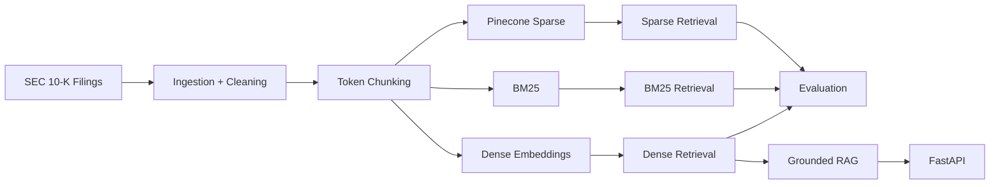
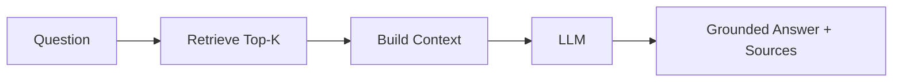
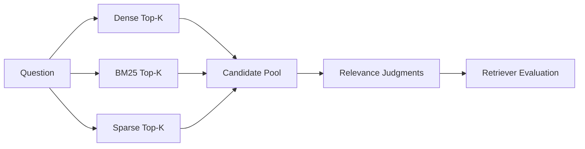
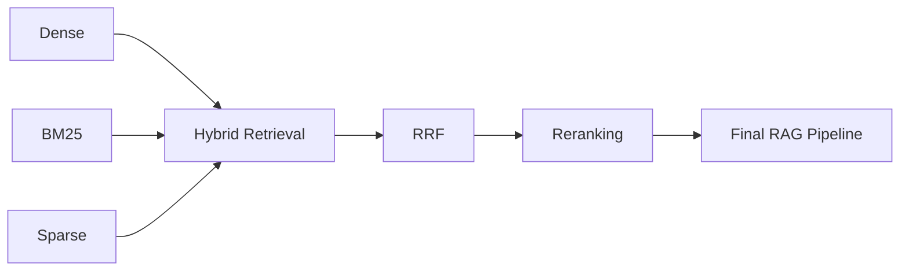

# SEC RAG Engine

Production-oriented RAG system for querying SEC 10-K filings with multiple retrieval strategies and measurable evaluation.

## Current Pipeline



## Data

Indexed filings:

- Apple 10-K
- Microsoft 10-K
- NVIDIA 10-K

Chunking:

- 800 token chunks
- 120 token overlap
- 267 total chunks
- deterministic chunk IDs
- SEC filing metadata stored with each chunk

## Retrieval

### Dense

- OpenAI `text-embedding-3-small`
- 1536 dimensions
- cosine similarity
- local dense retrieval
- Pinecone dense index

### BM25

- custom BM25 implementation
- term frequency
- inverse document frequency
- document length normalization
- `k1 = 1.5`
- `b = 0.75`

### Sparse

- Pinecone sparse index
- `pinecone-sparse-english-v0`
- same chunk IDs as dense retrieval
- supports incremental indexing

## RAG Flow



FastAPI endpoints:

```text
GET  /health
POST /ask
```

## Evaluation

Retrieval is evaluated using:

- Recall@K
- Precision@K
- MRR
- latency

Relevance labels were created using pooled candidates from Dense, BM25, and Sparse retrieval.



## Current Results

15-question benchmark:

| Retriever | Recall@1 | Recall@3 | Recall@5 | Precision@5 | MRR | Median Latency |
|---|---:|---:|---:|---:|---:|---:|
| Dense | **0.196** | **0.515** | **0.799** | **0.867** | **1.000** | 286.9 ms |
| BM25 | 0.124 | 0.305 | 0.505 | 0.613 | 0.802 | **0.303 ms** |
| Sparse | 0.135 | 0.320 | 0.448 | 0.547 | 0.833 | 66.1 ms |

Dense retrieval is currently the strongest standalone retriever.

## Project Structure

```text
sec-rag-engine/
├── api/
│   ├── main.py
│   └── rag.py
│
├── data/
│   ├── raw/
│   └── chunks/
│
├── evaluation/
│   ├── benchmark.json
│   ├── evaluate_dense.py
│   ├── evaluate_bm25.py
│   ├── evaluate_sparse.py
│   ├── run_rag_tests.py
│   └── results/
│
├── ingestion/
│   ├── sec_loader.py
│   └── chunker.py
│
├── retrieval/
│   ├── embedder.py
│   ├── build_embeddings.py
│   ├── search.py
│   ├── pinecone_store.py
│   ├── pinecone_search.py
│   ├── bm25_search.py
│   ├── sparse_store.py
│   └── sparse_search.py
│
├── FAILURES.md
├── requirements.txt
├── README.md
└── .gitignore
```

## Setup

```bash
python3 -m venv .venv
source .venv/bin/activate
pip install -r requirements.txt
```

Create a `.env` file with the required OpenAI and Pinecone credentials.

## Run Evaluations

```bash
python -m evaluation.evaluate_dense
python -m evaluation.evaluate_bm25
python -m evaluation.evaluate_sparse
```

## Run API

```bash
fastapi dev api/main.py
```

Swagger UI:

```text
http://127.0.0.1:8000/docs
```

## Next



Next milestone: Hybrid Retrieval using Reciprocal Rank Fusion.
