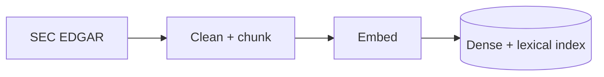

# AlphaBrief

AI-powered research for SEC 10-K filings with grounded answers and source-level evidence.

Ask a plain-English question about a public company's annual report and get a response built
only from retrieved filing text, with every answer backed by retrieved filing evidence. When
the filings do not support an answer, the system refuses instead of guessing.

## Live Demo

- Frontend: https://secfrontend.vercel.app
- Backend API docs (Swagger): https://sec-rag-engine.vercel.app/docs

## Current Scale

**92 companies · 274 annual 10-K filings · 45,252 indexed chunks**, as of the live
[`/health`](https://sec-rag-engine.vercel.app/health) and [`/companies`](https://sec-rag-engine.vercel.app/companies)
endpoints. This is a V1 launch corpus (large-cap US filers), not full SEC coverage.

## What It Does

Ask a question, get a grounded answer, then dig deeper on the same company:

1. **Ask**: *"How has NVIDIA's data center revenue changed from FY2023 to FY2025?"*
   → `$15.01B → $47.5B → $115.186B`, each figure cited back to its own 10-K.
2. **Dig deeper**: *"How has NVIDIA's discussion of export controls changed from FY2023 to
   FY2025?"* → a synthesized answer that keeps each fiscal year's risk-factor language
   separate and cited, e.g. FY2025: *"Our competitive position has been harmed by the
   existing export controls... if there are further changes in the USG's export controls."*

Every citation opens the underlying 10-K passage, with a link to the filing on SEC.gov — the
answer isn't the end of the workflow, it's a pointer back to the evidence.

- Pick one or more companies and fiscal years, or ask across the whole corpus.
- Compare across years or companies in a single question; each scope stays tied to its own
  filing, and nothing leaks across a comparison.
- Ask for a year or company that isn't ingested and the API says so directly — no silent
  substitution.

## Evaluation & Testing

**Correctness** (scope filtering, cross-year/cross-company isolation, numeric-year attribution)
is enforced in code, not just measured after the fact — every retrieval path applies the same
structured filter before generation, and that guarantee is checked by dedicated structural
tests, not sampled from a benchmark.

| Check | Result |
|---|---|
| Backend tests (`python -m pytest`) | **336 / 336** |
| Fiscal-year filter correctness, cross-year leakage, cross-company leakage, comparison scope coverage, numeric-year attribution | **1.000 / 0.000 / 0.000 / 1.000 / 1.000** — asserted by `tests/test_multiyear*.py`, `test_comparison.py`, `test_filters.py` |

**Retrieval quality** (MRR, Recall@K, Precision@K) is evaluated against `benchmark_v3_repool` —
125 questions covering 8 companies (AAPL, AMZN, GOOGL, JPM, META, MSFT, NVDA, WMT), scored live
against the current 92-company / 45,252-chunk corpus (2026-09-29):

| Metric | Result |
|---|---|
| MRR (hybrid) | 0.86 |
| Recall@10, capacity-capped (hybrid) | 0.66 |
| Precision@5 (hybrid) | 0.60 |

Down from a prior 10-company checkpoint (0.88 / 0.70 / 0.62) — consistent with BM25's
whole-corpus scoring drifting as the corpus grows roughly 10x, not a regression elsewhere.
**Caveat:** the question set still covers 8 of the 92 companies; extending it to the full
corpus is ongoing work. See `evaluation/evaluate_v3_current_corpus.py` and
`evaluation/SCALE_READINESS_REPORT.md` for the full methodology.

The generator only answers from retrieved evidence and refuses when it's insufficient — the
same 0.000 leakage numbers above are what keep a refusal from ever picking up evidence from
the wrong company or year. If reranking fails or is rate-limited, the request falls back to
hybrid top-5 rather than failing outright, and that fallback path is still scope-filtered.

## How It Works

**Ingestion (build-time):**


```mermaid
flowchart LR
    A[SEC EDGAR] --> B[Clean + chunk]
    B --> C[Embed]
    C --> D[(Dense + lexical index)]
```

**Query (request-time):**


```mermaid
flowchart LR
    Q[Question + scope] --> H[Hybrid search]
    H --> R[RRF fusion]
    R --> K[Rerank]
    K --> G[Grounded answer]
```

- **Dense**: OpenAI `text-embedding-3-small` (1536-dim) in Pinecone.
- **Lexical**: `bm25s` (`k1=1.5`, `b=0.75`) over a version-pinned, persisted index.
- **Fusion**: `candidate_k=10` per retriever, combined with Reciprocal Rank Fusion (`K=60`).
- **Rerank**: Cohere `rerank-v4.0-fast` on the fused candidates.
- **Scoping**: company/year filters are applied before retrieval, not after — the generator
  never sees a chunk outside the requested scope. An unsupported year returns a structured
  `422` instead of silently widening scope.
- **Comparisons**: each requested scope (company, year, or both) is retrieved and filtered
  independently, then unioned before a single shared rerank — so one scope's text can't leak
  into another's evidence.

## Tech Stack

- **Backend**: Python, FastAPI, Uvicorn.
- **Frontend**: Next.js, TypeScript (deployed on Vercel).
- **Retrieval**: OpenAI `text-embedding-3-small` + Pinecone (dense), `bm25s` (lexical), RRF
  fusion, Cohere `rerank-v4.0-fast`.
- **Generation**: OpenAI `gpt-5-nano`, constrained to the retrieved evidence.
- **Infrastructure**: Pinecone managed indexes, Vercel (read-only Python runtime for the API,
  static + SSR for the UI).

## Known Limitation — being worked on for launch

Loose, directly phrased revenue questions for ExxonMobil can safely refuse rather than return a
number: that filing's layout puts the consolidated total in a chunk without an adjacent
fiscal-year header, which is specific to that one filing's table structure. Anchored queries
("What does the consolidated statement of income show for total revenues?") already return the
correct value. Fixing the loose-query case for this filing shape is active pre-launch work.

## Repository Structure

```text
api/          FastAPI app, request validation, RAG orchestration, generation
ingestion/    SEC discovery, download, cleaning, chunking, ingestion ledger
retrieval/    embeddings, Pinecone clients, bm25s backend, RRF hybrid, Cohere reranker, scope
evaluation/   benchmarks, pooled judging, offline retrieval and multi-year validation
scripts/      bm25s index build, metadata backfills, filter regression checks
tests/        unit and structural tests (scope, leakage, numeric attribution, fallback)
data/         chunks, registry, persisted bm25s index, SEC cache (embeddings/raw gitignored)
```

See `INGESTION.md` for ingestion operations and `FAILURES.md` for recorded failure analysis.
